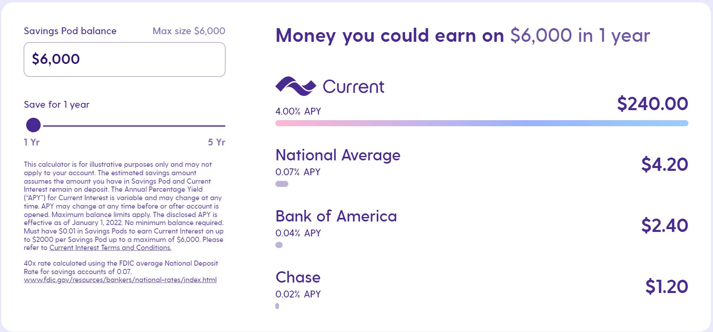

# Fintech Case Study: Finco Services, Inc. d.b.a Current

[Current.com](https://current.com/)

# Table of Contents

* Overview and Origin
* Business Activities
* Landscape
* Results
* Recommendations

## Overview and Origin

Finco Services, Inc. is a New York City-based financial services and software development company (FinTech) operating its mobile banking unit under the name Current.  Current was founded in 2017 by Stuart Sopp with mission to make banking accessible to everyone. The company was created based on the idea of making banking available to everyone anywhere and give and opportunity to enable online banking to people who have limited access in the traditional banking network.

## Business Activities

Current offers checking and saving accounts which individual and businesses can open in online through there app. The company have several core competancies that seperates them from the traditional banks:

<ol>
      * Option to open bank account through phone (no need to visit the bank)
      * Anywhere free fee ATMs
      * Faster Direct Deposit (2 days early before actual direct deposit)
      * High interest saving account (4.00% APY)
     
<li>
      
      
